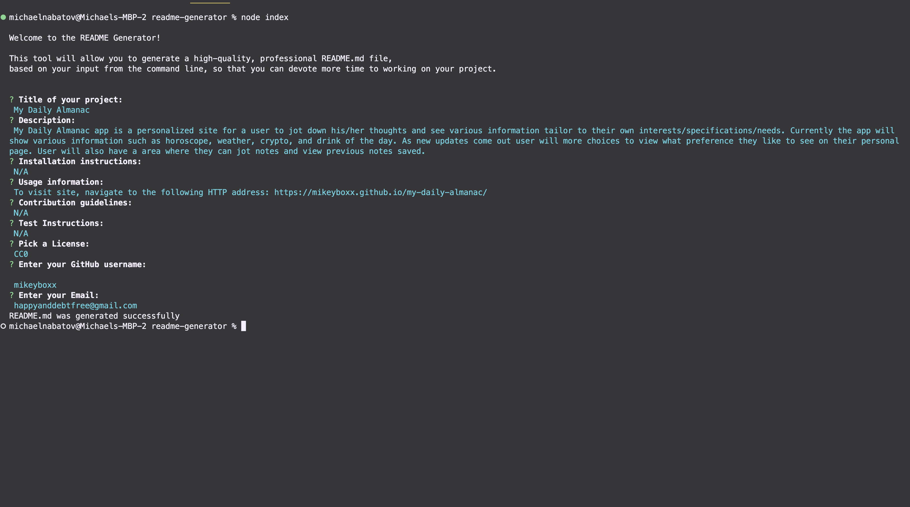
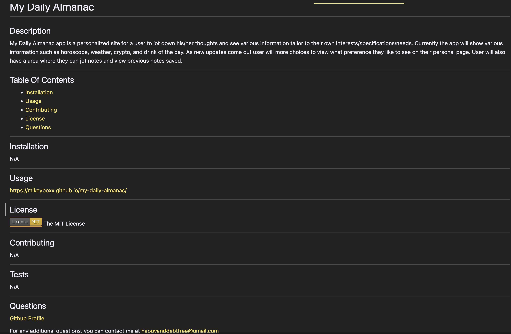

# README Generator

## Description

This is a command-line tool that allows a developer to generate a professional README file by answering a series of prompts. The generated README file contains the title of the project and sections entitled Description, Table of Contents, Installation, Usage, License, Contributing, Tests, and Questions. These sections reflect the user's answers to the command-line prompts. 

The License prompt is a list of choices, one for every license, from which the user must select one.  Once selected, a badge for that license is added near the top of the README and a notice is added to the section of the README entitled License that explains which license the application is covered under.

In addition, the system prompts for a GitHub username and an email address, which are added to the section of the README entitled Questions, with a link to my GitHub profile and instructions on how to contact with additional questions. Table of Contents ia also generated.

Once the user answers all questions, a README_GENR.md file is generated in the same directory as the application, containing functional links to the license and GitHub sites. Also, the email address is a link to an email client installed on their machine.

---

## Table Of Contents
- [Installation](#installation)
- [Usage](#usage)
- [Contributing](#contributing)
- [License](#license)
- [Questions](#questions)

---

## Installation

N/A

---

## Usage

Type `npm index.js` in the command line and answer all questions. Then copy the README_GENR.md file to the directory of your choice.

[Demo Video](https://drive.google.com/file/d/1WNDcT4hT086ZPirMHPu0B9GAFv_nHrZ9/view)

---

## Screenshots

---

## License

The MIT License

---

## Contributing

N/A

---

## Tests

N/A

---

## Questions

[Github Profile](https://www.github.com/mikeyboxx)

For any additional questions, you can contact me at happyanddebtfree@gmail.com

---

